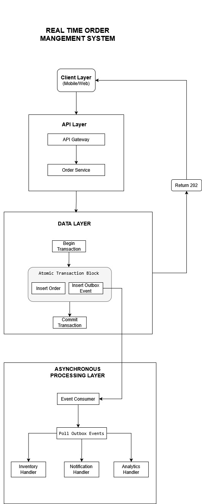

# Realtime Order Management System (Transactional Outbox Architecture)

## Architecture Overview
This system implements the Transactional Outbox Pattern to ensure reliable message processing while maintaining high API performance. The architecture separates fast synchronous operations from slow asynchronous processing.

## Core Components

1. **Order Service (API Service)**
   * **Order Placement:** Creates order and outbox event atomically.
   * **Status Updates:** Immediate status changes with event emission.
   * **Cancellation:** Fast cancellation with compensation events.
   * **Response Time:** Guaranteed <200ms for all API operations.

2. **Database Layer**
   * **PostgreSQL:** Primary data store.
   * **Outbox Table:** Event queue for async processing.
   * **Processed Events:** Idempotency protection.
   * **Row Locking:** Prevents inventory race conditions.

3. **Processing Layer (Consumer Service)**
   * **Event Processing:** Polls outbox table for new events.
   * **Inventory Management:** Deduction and restoration.
   * **Idempotent Operations:** Prevents duplicate processing.
   * **Compensation Logic:** Handles order cancellations.


<p align="center">
  
</p>

## Key Features

### ✅ Transactional Outbox Pattern
* **Atomic order and event creation:** Ensures data consistency.
* **Guaranteed event delivery:** The consumer polling ensures eventual processing.
* **No lost messages:** Database persistence prevents data loss during service failures.

---

### ✅ Inventory Management
* **Async deduction on order placement:** Decouples inventory logic from the API response time.
* **Automatic restoration on cancellation:** Handles compensating transactions seamlessly.
* **Row-level locking for consistency:** Prevents race conditions (overselling) during concurrent updates.

---

### ✅ Order State Machine 
The flow of an order from initial placement to completion or cancellation. 

* **Primary Flow:**
    * **PLACED** $\rightarrow$ **PREPARING** $\rightarrow$ **OUT\_FOR\_DELIVERY** $\rightarrow$ **DELIVERED**
* **Cancellation State:**
    * An order can transition to **CANCELLED** from any state before **DELIVERED**.

---

### ✅ Idempotent Processing
* **Prevents duplicate event processing:** Uses the `processed_events` table to track handled event IDs.
* **Ensures data consistency:** Guarantees that even if an event is redelivered, the associated side effect (like inventory deduction) happens only once.
* **Handles consumer restarts:** Allows the consumer service to safely restart and re-poll the outbox without creating duplicate entries or errors.

## API Endpoints 🚀

| Method | Endpoint | Description |
| :--- | :--- | :--- |
| **POST** | `/api/v1/orders` | Place a **new order** (Fast Path, returns `202 Accepted`). |
| **GET** | `/api/v1/orders/{id}` | Get detailed **order information**. |
| **PATCH** | `/api/v1/orders/{id}/status` | Update the **order status** (emits event). |
| **POST** | `/api/v1/orders/{id}/cancel` | **Cancel** the order (emits event for inventory restoration). |

---

## Event Types (Transactional Outbox) 📬

| Event | Trigger | Purpose |
| :--- | :--- | :--- |
| `order.placed.v1` | Order creation | Triggers **asynchronous inventory deduction** and state change. |
| `order.status.{status}.v1` | Status update | Notifies downstream services (e.g., delivery, customers). |
| `order.cancelled.v1` | Order cancellation | Triggers **asynchronous inventory restoration** and final state transition. |


## Setup & Run Instructions

1.  **Prerequisites:** Ensure **Docker** and **Docker Compose** are installed on your machine.
2.  **Run the System:**
    ```bash
    # Build the image and start the API, DB, and Consumer services
    docker-compose up --build
    ```
    - The `db` service (PostgreSQL) is started first.
    - The `api` and `consumer` services wait for the DB to be healthy before starting.

3.  **Access:**
    -   API Documentation (Swagger UI): `http://localhost:8000/docs`
    -   Consumer Logs: Monitor the terminal output from the `consumer` service.


## Testing Flow 🧪

The testing flow demonstrates the separation of the **Fast Path (API)** and the **(Consumer)** through the Transactional Outbox Pattern.

### 1. Initialization/Setup (Using Inventory API)

Before placing an order, you must set up the necessary data using the inventory endpoints:

* **Setup Restaurant:** Use `POST /api/v1/inventory/add/restaurant` with the restaurant name.
* **Setup Menu Item & Initial Stock:** Use `POST /api/v1/inventory/add/{restaurant_id}/item` to create a menu item and set its initial `available_qty`.
* **Verify Stock:** Use `GET /api/v1/inventory/{menu_item_id}` to check the initial stock level (e.g., 10 units).

---

### 2. Place Order (Fast Path Test)

* **Action:** Execute `POST /api/v1/orders`. Use the seeded restaurant and item IDs in the request body (conforming to the `OrderRequest` Pydantic schema).
* **Observation (API):** The API returns **immediately** with status `PLACED` and a `202 Accepted` status code, demonstrating the **fast path latency guarantee**.
* **Observation (Consumer - Slow Path):** The `consumer` service logs will show:
    * The event being dispatched (`order.placed.v1`).
    * Inventory deduction logic executing, using **`SELECT FOR UPDATE`** for locking.
    * The order status being updated to `PREPARING` via the `inventory.deducted.success.v1` event chain.
* **Verification:** Re-verify stock using `GET /api/v1/inventory/{menu_item_id}`. The stock should now be **reduced** by the ordered quantity (e.g., 9 units).

---

### 3. Test Cancellation (Compensation Logic Test)

* **Action:** Use the `order_id` from step 2 and execute `POST /api/v1/orders/{order_id}/cancel`.
* **Observation (API):** The API returns instantly with status `CANCELLED`.
* **Observation (Consumer - Slow Path):** The `consumer` service logs will show:
    * Detection of the `order.cancelled.v1` event dispatch.
    * The **inventory restoration** logic executing.
* **Verification:** Re-verify stock using `GET /api/v1/inventory/{menu_item_id}`. The stock should be **restored** to the previous level (e.g., back to 10 units).